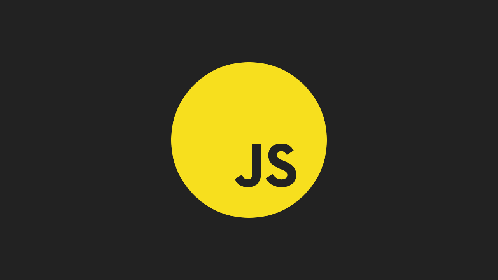

[](http://shaunlebron.github.io/solar-system-of-js/)

[](http://shaunlebron.github.io/solar-system-of-js/)

## Implementation

The presentation is written in  ClojureScript, visuals in Canvas2D api.

Each slide transition is driven by an [actions spec](https://github.com/shaunlebron/solar-system-of-js/blob/master/src/solar_system_of_js/actions.cljs#L160)
to animate state data, which is then drawn by the [draw functions](https://github.com/shaunlebron/solar-system-of-js/blob/master/src/solar_system_of_js/draw.cljs#L443).
`core.async` is used for all timing/animation.

- `actions.cljs` - slide transition state actions
- `animate.cljs` - animation utility (using core.async go-blocks)
- `canvas.cljs` - canvas initialization and api wrapper
- `caption.cljs` - caption setter in markdown
- `control.cljs` - touch/key controls
- `core.cljs` - entry point
- `draw.cljs` - all drawing functions
- `math.cljs` - math aliases
- `nav.cljs` - slide navigation functions (next/previous)
- `state.cljs` - state of the application
- `tick.cljs` - heartbeat of the application

## Setup

```
lein figwheel dev
```

Open <http://localhost:3449>
