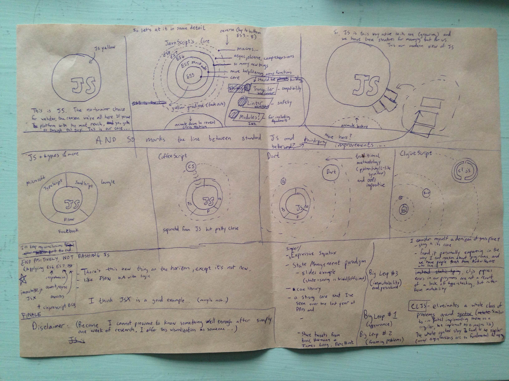

[](http://shaunlebron.github.io/solar-system-of-js/)
[](http://shaunlebron.github.io/solar-system-of-js/)

__[>> View the "Solar System of JS"](http://shaunlebron.github.io/solar-system-of-js/)__

I made this to visualize the __current state of languages on the JS platform__,
because I am frankly overwhelmed by all the different activity happening in
this space.  It was originally motivated by a desire to bring ClojureScript
into this view, as a language that I think has simple, fundamental solutions to
a lot of the problems that are fragmenting JS.

## Implementation

The code is written in \*
ClojureScript. It implements its own animated presentation architecture that
hopefully serves as an example for interesting things that can be done with the
language.

###### Some features:

- frames are drawn to a Canvas using the 2D api
- all animations tap a `core.async` channel to receive a delta-time `dt` value every frame.
- slide transitions are driven by an [actions spec] to animate [state data]
- the incremental actions spec allows us to jump ahead to specific slides (for URL routing)
- the [drawing] is a pure function of the application state (basically)

###### File Descriptions:

- [`core.cljs`](src/solar_system_of_js/core.cljs)- entry point
- [`actions.cljs`](src/solar_system_of_js/actions.cljs)- slide transition state actions
- [`animate.cljs`](src/solar_system_of_js/animate.cljs)- animation utility (using core.async)
- [`canvas.cljs`](src/solar_system_of_js/canvas.cljs)- canvas initialization and api wrapper
- [`caption.cljs`](src/solar_system_of_js/caption.cljs)- caption setter in markdown
- [`control.cljs`](src/solar_system_of_js/control.cljs)- touch/key controls
- [`draw.cljs`](src/solar_system_of_js/draw.cljs)- all drawing functions
- [`math.cljs`](src/solar_system_of_js/math.cljs)- math aliases
- [`nav.cljs`](src/solar_system_of_js/nav.cljs)- slide navigation and routing
- [`state.cljs`](src/solar_system_of_js/state.cljs)- state of the application

_\* The [logo] is part of a branding effort for a proper ClojureScript
website that we are building this year, with docs pages and tutorials._

## Development Setup

1. Install [leiningen]
2. Run this to get a live-reload compiler, http server, and REPL:

    ```
    $ lein figwheel dev
    ```

3. Open <http://localhost:3449>

## Contact

- email: <shaun.e.williams@gmail.com>
- twitter: [@shaunlebron](http://twitter.com/shaunlebron)

## License

MIT

----

[](https://raw.githubusercontent.com/shaunlebron/solar-system-of-js/master/sketch.jpg)

[actions spec]:https://github.com/shaunlebron/solar-system-of-js/blob/master/src/solar_system_of_js/actions.cljs#L160
[state data]:https://github.com/shaunlebron/solar-system-of-js/blob/master/src/solar_system_of_js/state.cljs#L5
[drawing]:https://github.com/shaunlebron/solar-system-of-js/blob/master/src/solar_system_of_js/draw.cljs#L459
[leiningen]:http://leiningen.org/
[logo]:https://github.com/oakmac/cljs.info/blob/master/00-scrap/cljs_logo-01.svg

